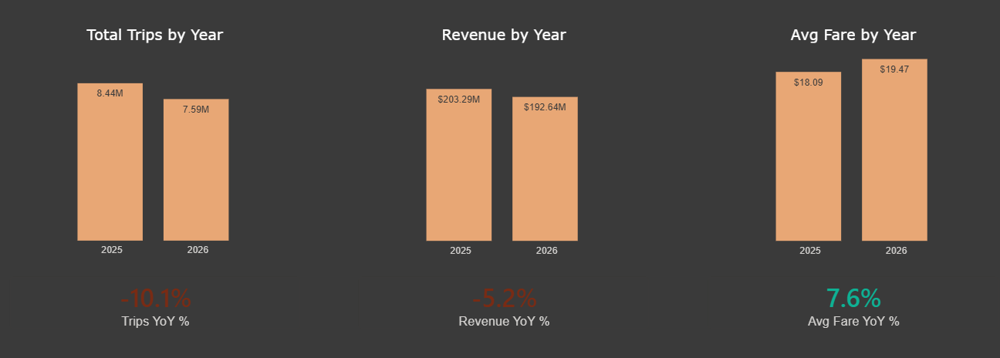
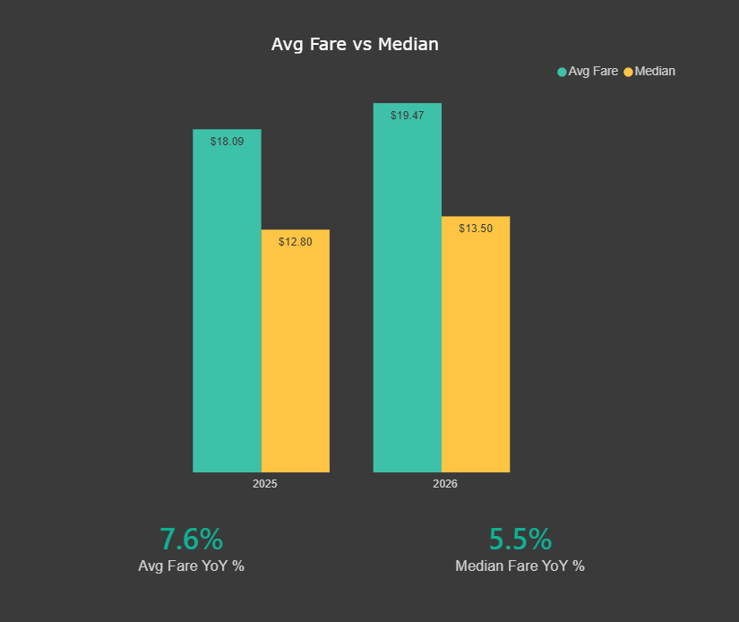
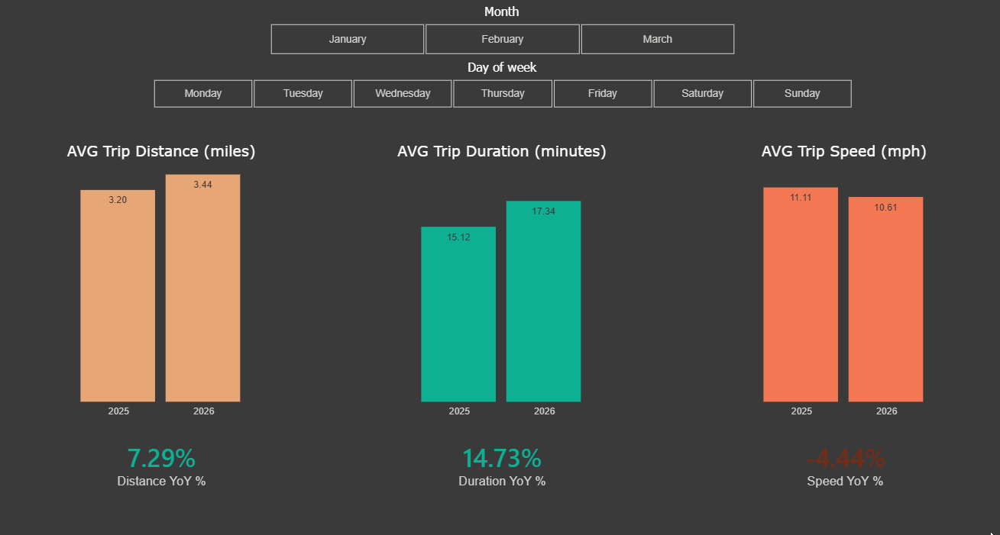
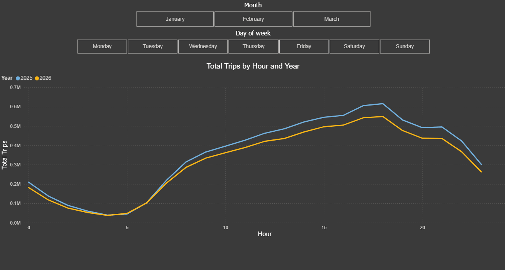
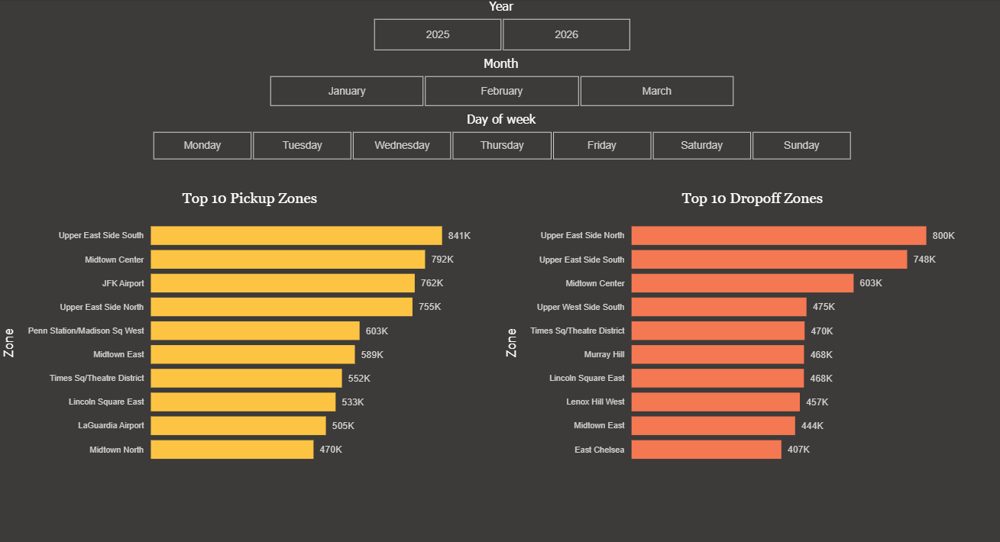

# Standard NYC Yellow Taxi — YoY Analysis (Q1 2025 vs Q1 2026)

Year-over-year analysis of standard NYC Yellow Taxi trips, comparing the first
quarter (January–March) of 2025 against the same period in 2026.

## Research Questions

1. Did the number of trips grow or decline?
2. Did the payment split (card vs cash) change?
3. How did fare per trip change — average and median?
4. How did total revenue change, and was it driven by volume or price?
5. How did fare per mile change?
6. How did distance, duration and speed change — and what does that say about traffic?
7. How did the tip-to-fare ratio change? (card trips only)
8. How did trip volume change by time of day and weekday vs weekend?
9. Which pickup/dropoff zones were most popular, and did the ranking shift?

## Data Source

Data comes from the NYC Taxi & Limousine Commission (TLC) Trip Record Data,
published monthly in Parquet format:
https://www.nyc.gov/site/tlc/about/tlc-trip-record-data.page

This analysis uses six monthly Yellow Taxi files (2025-01 to 2025-03 and
2026-01 to 2026-03) plus the official taxi zone lookup table.

### Scope

This analysis examines **standard trips only**: `payment_type IN (1, 2)`
(credit card and cash). Flex Fare trips (`payment_type 0`) are excluded on purpose — they use a
different pricing system, so they cannot be compared with standard metered trips.

## Exploratory Data Analysis (EDA)

EDA was performed on all six monthly files before any cleaning. The goal at this
stage was only to understand the data and document problems — no rows were
removed and no cleaning decisions were made here.

### What was done
- Loaded each of the six Parquet files (2025-01 to 2025-03, 2026-01 to 2026-03).
- Compared the schema across all files using `df.info()`.
- Reviewed value ranges with `df.describe()` (focus on `fare_amount` and
  `trip_distance`).
- Counted missing values per column with `df.isnull().sum()`.
- Examined the `payment_type` distribution with `value_counts(normalize=True)`.

### What was observed

**Schema is consistent across all six files.** All files have the same 20
columns with identical data types, so combining them later will be safe (no
type-mismatch issues between months).

**Missing values cluster together.** The same five columns are always null
together — `passenger_count`, `RatecodeID`, `store_and_fwd_flag`,
`congestion_surcharge`, and `Airport_fee` — and always with an identical count
per file. This looks like the gaps come from one specific type of record,
not random missing data. It affects about 15–30% of rows per file.

**Invalid timestamps exist.** Some files contain pickup dates far outside their
month — for example, trips dated 2007 and 2008 appear in the March files. Some
dropoff times also fall slightly outside the file's month. Dates will need to be
constrained to the actual study period.

**Negative and extreme monetary values.** `fare_amount` and `total_amount` both
have negative minimums (down to about -2,555) and absurd maximums (e.g.
`fare_amount` up to ~863,000 in 2025-01). But the middle of the data is normal
(~8.6–27 USD), so the typical trip looks fine — only the extremes are broken.

**Impossible trip distances.** `trip_distance` has a median of ~1.7–1.8 miles
across all files, but maximums reach into the hundreds of thousands of miles,
which is physically impossible. Minimum distance is 0 (zero-distance trips also
exist).

**payment_type distribution and Flex Fare growth.** Flex Fare trips
(`payment_type 0`) make up a large and growing share: roughly 15–22% in 2025 and
24–30% in 2026. This supports the decision to exclude them: their share
changed a lot between the two years, so including them could create a fake
year-over-year change that has nothing to do with standard trips. Payment types
3, 4, and 5 (no charge, dispute, unknown) are small (~2–3% combined) and likely
account for some of the negative monetary values; they fall outside the scope
(payment_type 1, 2) as well.

**Note on fare medians.** The raw median `fare_amount` appears higher in 2026
than in 2025. This is only a first look at raw, unfiltered data, not a
conclusion — it is properly checked later on cleaned data.

### Scope impact

Applying the scope filter (`payment_type IN (1, 2)`) removes Flex Fare and other
non-standard payment types before any cleaning:

| File | Raw rows | After scope | Removed | % removed |
|---|---|---|---|---|
| 2025-01 | 3,475,226 | 2,834,822 | 640,404 | 18.4% |
| 2025-02 | 3,577,543 | 2,675,656 | 901,887 | 25.2% |
| 2025-03 | 4,145,257 | 3,110,013 | 1,035,244 | 25.0% |
| 2026-01 | 3,724,889 | 2,563,790 | 1,161,099 | 31.2% |
| 2026-02 | 3,399,866 | 2,325,277 | 1,074,589 | 31.6% |
| 2026-03 | 3,952,451 | 2,962,371 | 990,080 | 25.1% |

## Cleaning

After scoping to standard trips, the following quality filters were applied. Each
filter targets a specific problem found during EDA. One filter considered during
EDA was deliberately **not** applied (see below).

Filters are applied in this order: scope (payment_type) → date bounds → duration →
fare → speed. First come the filters that decide which trips belong in the study
(payment type, dates), then the ones that remove broken records. `duration_min` and
`speed_mph` are calculated first, because the filters need them.

### Filters applied

| Filter | Rule | Rationale |
|---|---|---|
| Scope | `payment_type IN (1, 2)` | Standard metered trips only; Flex Fare uses separate pricing (see Scope) |
| Date bounds | pickup within the file's month | EDA found pickups dated 2007–2008 and outside the file's month |
| Minimum duration | `duration_min >= 1` | Trips under one minute are not real rides; also removes negative durations (bad timestamps) |
| Minimum fare | `fare_amount >= 3` | NYC base fare is $3.00 (includes negative fares from EDA) |
| Speed bounds | `1 < speed_mph <= 100` | Removes physically impossible speeds. The lower bound also removes zero-distance trips (speed = 0) and stalled-meter trips where the cab barely moves over many hours |

### Rows removed per filter

Rows remaining after each filter, per file:

| File | Raw | After scope | After dates | After duration | After fare | After speed (final) | Kept |
|---|---|---|---|---|---|---|---|
| 2025-01 | 3,475,226 | 2,834,822 | 2,834,800 | 2,809,883 | 2,796,723 | 2,782,410 | 80.1% |
| 2025-02 | 3,577,543 | 2,675,656 | 2,675,625 | 2,649,958 | 2,637,456 | 2,622,664 | 73.3% |
| 2025-03 | 4,145,257 | 3,110,013 | 3,109,980 | 3,062,238 | 3,046,245 | 3,031,010 | 73.1% |
| 2026-01 | 3,724,889 | 2,563,790 | 2,563,785 | 2,493,048 | 2,484,334 | 2,474,157 | 66.4% |
| 2026-02 | 3,399,866 | 2,325,277 | 2,325,261 | 2,262,134 | 2,255,818 | 2,246,117 | 66.1% |
| 2026-03 | 3,952,451 | 2,962,371 | 2,962,352 | 2,883,854 | 2,878,623 | 2,867,760 | 72.6% |

2026 keeps fewer rows almost entirely because of the scope filter (the growing Flex
Fare share, removed before any cleaning), not because of data quality — the quality
filters remove a similar small share in both years.

### Deliberately not applied

- **`RatecodeID = 99` (unknown rate code):** ~41k rows, but `describe()` showed
  these are real trips (median ~6.7 miles, ~$31 fare). The speed filter already
  removes the truly broken ones, so dropping all of them would throw away good data.

## Validation

After loading, the data was validated with SQL checks (sql/validation.sql): no NULLs in any kept column, all cleaning filters held (no rows violating fare, duration, speed, or payment_type rules), dropoff always after pickup, pickup dates within the study period, and total row count matching the load output (16,024,118). All checks passed.

## Analysis

Each question is answered by a SQL query in `sql/` (one file per question).
All comparisons are Q1 2025 vs Q1 2026, standard trips only.

### Q1 — Trip volume

| Year | Trips |
|---|---|
| 2025 | 8,436,084 |
| 2026 | 7,588,034 |

Standard trips fell ~10% year over year. Since Flex Fare's share grew over the
same period (see Scope), part of this decline may reflect a shift toward Flex
Fare rather than an overall drop in demand.

### Q2 — Payment split

| Year | Card | Cash | Card % |
|---|---|---|---|
| 2025 | 7,383,431 | 1,052,653 | 87.5% |
| 2026 | 6,717,918 | 870,116 | 88.5% |

The card share rose slightly, from 87.5% to 88.5%. Both card and cash trip counts
fell year over year (overall volume declined, see Q1), but cash fell proportionally
more (−17% vs −9% for card), shifting the mix further toward card payment.

### Q3 — Fare per trip (average and median)

| Year | Avg fare | Median fare |
|---|---|---|
| 2025 | $18.09 | $12.80 |
| 2026 | $19.47 | $13.50 |

Both the average (+7.6%) and median (+5.5%) fare rose, so the typical trip really
did get more expensive — it is not just a few expensive trips pulling the average
up. The average rose a bit faster than the median, which means expensive trips grew
slightly more, but normal trips got pricier too.

### Q4 — Revenue and what drove it

Revenue excludes tips (which go to the driver, not the operator).

| Year | Trips | Revenue | Revenue per trip |
|---|---|---|---|
| 2025 | 8,436,084 | $203.3M | $24.10 |
| 2026 | 7,588,034 | $192.6M | $25.39 |

Trips fell 10.0%, but revenue fell only 5.2% — because revenue per trip rose 5.4%.
Operators ran 10% fewer trips but lost only ~5% of revenue. Fewer trips pushed
revenue down while higher prices pushed it up, and the higher prices covered about
half of the loss.

### Q5 — Fare per mile

| Year | Fare per mile |
|---|---|
| 2025 | $5.65 |
| 2026 | $5.67 |

Computed as SUM(fare) / SUM(distance). This way longer trips count more, which
avoids the problem of very short trips (where fare per mile becomes huge). Fare per
mile was basically flat (+0.4%). Together with Q3 (fare per trip up ~5–7%), this
means the higher fares come from longer trips, not from a higher price per mile.
Q6 checks this directly.

### Q6 — Distance, duration, speed (average and median)

| Year | Avg dist | Med dist | Avg dur | Med dur | Avg speed | Med speed |
|---|---|---|---|---|---|---|
| 2025 | 3.20 | 1.66 | 15.12 | 11.68 | 11.11 | 9.45 |
| 2026 | 3.44 | 1.70 | 17.34 | 12.75 | 10.61 | 8.95 |

Distance rose only slightly (median +2.4%), but duration rose much more (median
+9.2%), so speed fell (median −5.3%). The typical trip covers about the same
distance but takes noticeably longer, which points to worse traffic. Both the
average and the median moved the same way, so the slowdown is real and not caused
by a few odd trips. This also answers Q5: since the price per mile stayed flat and
distance barely grew, fares went up mainly because trips took longer.

### Q7 — Tip as a share of fare (card trips only)

| Year | Tip % of fare |
|---|---|
| 2025 | 22.84% |
| 2026 | 21.19% |

Computed as SUM(tip) / SUM(fare) over card trips only (payment_type = 1), because
cash tips are barely recorded in the data — that is a limit of the data, not a
choice. Trips with no tip are included, so this is the average across all card
trips. The tip share fell from 22.84% to 21.19% (−1.65pp). As fares rose (Q3),
riders tipped a smaller share. Tips probably grew in dollars but shrank compared to
the higher fare, which often happens when prices go up.

### Q8a — Trip volume by hour of day

Trips per hour as a share of each year's total (using shares removes the ~10%
overall drop, so the shape of the day can be compared).

| | 2025 | 2026 |
|---|---|---|
| Peak hour | 18:00 (7.30%) | 18:00 (7.24%) |
| Quietest hour | 04:00 (0.46%) | 04:00 (0.50%) |

The daily pattern barely changed — the evening peak stays at 18:00, the quietest
time at ~04:00, and the two lines almost overlap. One small shift: late evening
(22:00–23:00) dropped a little while early morning (07:00) rose a little, but these
are fractions of a percent. Full hourly data is shown in the Power BI dashboard.

### Q8b — Weekday vs weekend volume

| Year | Weekday | Weekend | Weekday % |
|---|---|---|---|
| 2025 | 6,099,951 | 2,336,133 | 72.31% |
| 2026 | 5,591,715 | 1,996,319 | 73.69% |

The decline was not evenly spread across the week. Weekend trips fell 14.5% year
over year, while weekday trips fell only 8.3% — so the weekend share dropped from
27.7% to 26.3%. The overall 10% drop (Q1) hides a much bigger drop on
weekends. (Read the shares with some caution: January–March does not have an even
number of weekend and weekday days. The year-over-year drops compare the same
periods, so those are reliable.)

### Q9 — Top pickup zones

Top 10 pickup zones by trips, with each zone's share of that year's total.

| Rank | 2025 | Trips | Share | 2026 | Trips | Share |
|---|---|---|---|---|---|---|
| 1 | Upper East Side South | 434,048 | 5.15% | Upper East Side South | 406,677 | 5.36% |
| 2 | Midtown Center | 433,281 | 5.14% | JFK Airport ▲ | 388,719 | 5.12% |
| 3 | Upper East Side North | 392,341 | 4.65% | Upper East Side North | 362,960 | 4.78% |
| 4 | JFK Airport | 373,146 | 4.42% | Midtown Center ▼ | 358,424 | 4.72% |
| 5 | Penn Station/Madison Sq West | 321,296 | 3.81% | Penn Station/Madison Sq West | 281,304 | 3.71% |
| 6 | Midtown East | 313,527 | 3.72% | Midtown East | 275,522 | 3.63% |
| 7 | Times Sq/Theatre District | 309,853 | 3.67% | Lincoln Square East ▲ | 251,798 | 3.32% |
| 8 | Lincoln Square East | 281,635 | 3.34% | Times Sq/Theatre District ▼ | 241,782 | 3.19% |
| 9 | LaGuardia Airport | 264,219 | 3.13% | LaGuardia Airport | 241,075 | 3.18% |
| 10 | Midtown North | 254,340 | 3.01% | Midtown North | 215,309 | 2.84% |


The same zones lead in both years. The big change: JFK Airport moved from 4th to
2nd, and was the only top-10 zone with more trips than the year before (373k → 389k)
even though total trips fell 10%. Airport trips stayed strong while city trips
dropped. This fits the other findings — airport trips are longer and cost more,
which helped revenue (Q4) and pushed up the average fare (Q3).

## Dashboard (Power BI)

An interactive Power BI dashboard visualizes the analysis. Static pages are shown as
images; interactive features (slicers, cross-filtering, map drill-down) are shown as GIFs.

### Overview


Trips fell 10% year over year, but revenue fell only 5% — because average fare rose
7.6%. The price increase cushioned the drop in volume.

### Pricing


Average fare sits well above the median in both years, showing a right-skewed
distribution — a few expensive trips (airport, long-haul) pull the average up while
the typical trip stays near $13.

### Traffic


Distance rose slightly and duration rose more, so speed fell — consistent with
worsening traffic. Slicers allow filtering by month and day of week.

### Time patterns


The hourly demand curve is stable year over year, peaking around 18:00. Filterable
by day of week.

### Zones



JFK Airport rose from 4th to 2nd busiest pickup zone. The map shows trip flow —
selecting a pickup zone highlights where those trips ended.

## Conclusion

Standard NYC Yellow Taxi trips declined year over year, but revenue declined less
than volume.

Trip volume fell 10.0% (8.44M to 7.59M), while revenue fell 5.2% ($203.3M to
$192.6M). The difference is explained by revenue per trip, which rose 5.4% ($24.10
to $25.39). The price increase offset about half of the volume decline.

The higher per-trip fare did not come from a higher per-mile rate. Fare per mile was
flat (+0.4%), while average trip duration rose 14.7% and average distance rose only
7.5%. Average speed fell 4.4% (11.11 to 10.61 mph). Trips covered similar distances
but took longer, which is consistent with increased traffic. So the per-trip fare
rose mainly because trips took more time, not because the rate per mile changed.

The decline was uneven across the week. Weekend trips fell 14.5% against 8.3% for
weekdays, lowering the weekend share from 27.7% to 26.3%. The hourly demand profile
was unchanged, peaking at 18:00 in both years.

Airport demand held up against the overall decline. JFK Airport rose from the 4th to
the 2nd busiest pickup zone and was the only top-10 zone to grow in absolute terms
(373k to 389k trips). These longer, higher-fare airport trips contributed to both
the revenue and the average fare figures above.

Tip as a share of fare fell from 22.84% to 21.19%. Tips likely rose in absolute
dollars but fell as a share of the higher fare.

## Business Implications & Next Steps

### Weekend decline needs a closer look

Weekend trips fell 14.5%, while weekday trips fell only 8.3%. There are two
possible reasons: riders moved to Flex Fare, which is not part of this analysis
(see Scope) but grew over the same period, or fewer people wanted a taxi on
weekends. This data cannot tell which one it is — looking at Flex Fare trips by
day type would answer it.

### Airport routes held up best

JFK Airport was the only top-10 pickup zone that grew (373k to 389k trips), while
overall trips fell 10%. Airport trips are longer and cost more, so each one brings
in more money. If drivers have to be sent somewhere first, airport routes look like
the safer choice. This data does not show if airport demand actually grew or just
stayed flat while city trips dropped — airport passenger numbers would show that.

### Slower traffic

Trips took 14.7% longer while distance only rose 7.5%, so average speed dropped
4.4%. Each trip takes more time, so a driver finishes fewer trips per shift. Fares went
up, but that may not cover the lost trips — it is worth checking what drivers earn
per hour, not per trip.

### What this data cannot answer

This analysis shows what changed, not why. It cannot say if riders moved to
Flex Fare, to Uber, or just travelled less. Answering that would need Flex Fare
data, competitor data, or external sources like airport passenger numbers.

## Assumptions & Limitations

- Only standard trips are included (`payment_type IN (1, 2)`). Flex Fare is
  excluded, so this is not total taxi activity. Flex Fare's share grew, so part of
  the trip decline may be a shift to Flex Fare rather than lost demand.
- "Q1" means January–March. The two periods do not have the same number of weekend
  and weekday days, so weekday/weekend shares should be read with some caution.
- Revenue excludes tips, since tips go to the driver, not the operator.
- Tips are analyzed on card trips only, because cash tips are barely recorded.
- Median values in the dashboard are fixed numbers calculated in SQL, because Power
  BI cannot run `MEDIAN` on 16M rows. The medians are exact SQL results.
- Cleaning limits (fare ≥ $3, 1 < speed ≤ 100 mph, duration ≥ 1 min) are based on
  physical and regulatory limits.

## How to Run

1. Install dependencies:
```bash
   pip install -r requirements.txt
```
2. Download the data from the TLC site (six Yellow Taxi Parquet files: 2025-01 to
   2025-03 and 2026-01 to 2026-03, plus the taxi zone lookup CSV) into a `data/`
   folder.
3. Create a PostgreSQL database called `nyc_taxi`. Copy `.env.example` to `.env` and
   add your connection details.
4. Clean and load the data:
```bash
   python src/clean.py
   python src/load_to_db.py
```
5. Run `sql/validation.sql` to check the loaded data (all checks return 0).
6. Run the query files in `sql/` (one per research question).
7. The Power BI dashboard connects to the local `nyc_taxi` database. See the
   Dashboard section above for screenshots and demos.

